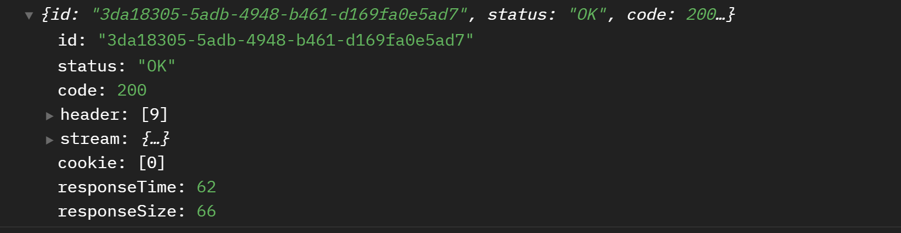
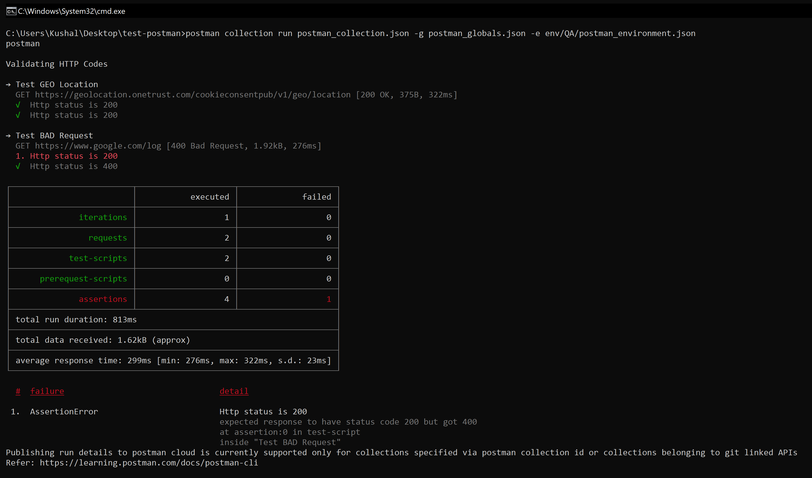

# postman-cli-with-github-actions

This repo uses Postman CLI with Github Actions

## Run Command:

```
postman collection run postman_collection.json -g postman_globals.json -e env/QA/postman_environment.json
```

## Sample Response of GEOLOCATION API



## Result:




## Common Errors:

1) Error: No authorization data found.

This error means that you are no authenticated with a valid POSTMAN API KEY

see more: https://learning.postman.com/docs/postman-cli/postman-cli-options/#logging-in-and-logging-out